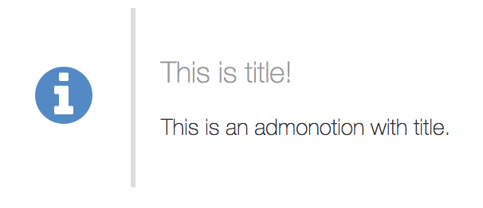
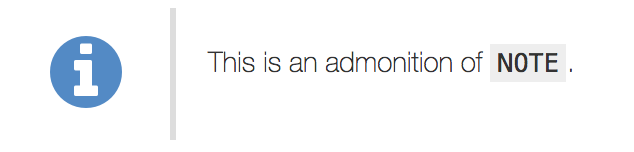
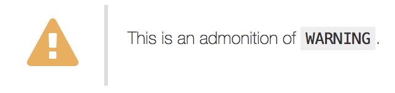
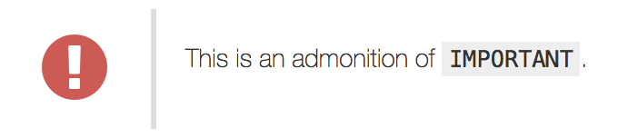

Gaiden Extension: Admonition
============================

This is a good example of using Gaiden Extension effectively.


## Installation

1. Check out or download this repository.
2. Copy `extensions/admonition` directory into your gaiden project.
3. Write a following admonition syntax in your Markdown page.


## Admonition syntax

The important point is that the Markdown source also is not so ugly.


### Basic

```markdown
 **NOTE**: This is a simple description.
```


```markdown
 > **NOTE**
 >
 > This is a description with multiple lines in source.
 > How about?
```


```markdown
 > **NOTE**: This is title!
 >
 > This is an admonition with title.
```




### Admonition types

You can use `NOTE`, `TIP`, `WARNING` and `IMPORTANT`.

```markdown
 **NOTE**: This is an admonition of `NOTE`.
```



```markdown
 **TIP**: This is an admonition of `TIP`.
```


```markdown
 **WARNING**: This is an admonition of `WARNING`.
```



```markdown
 **IMPORTANT**: This is an admonition of `IMPORTANT`.
```



